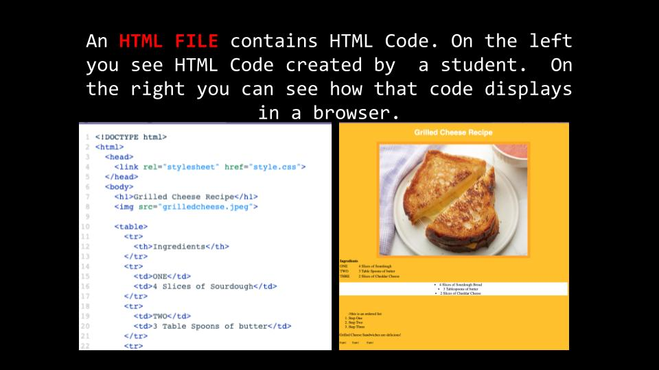
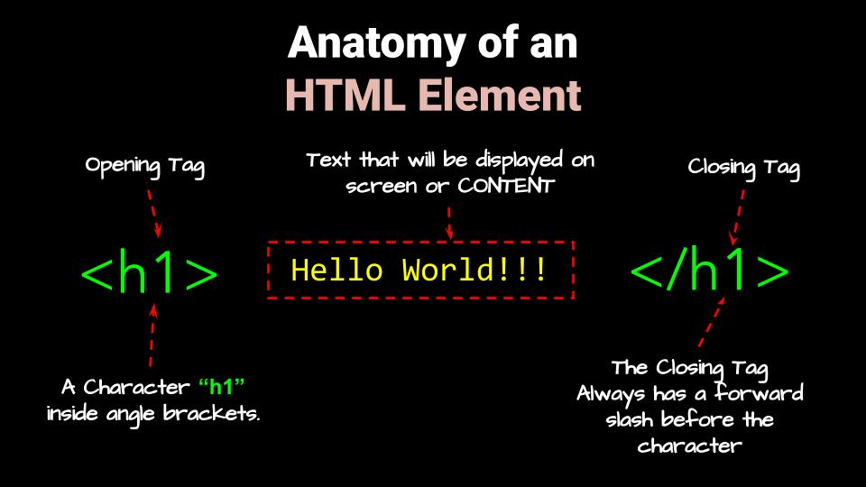
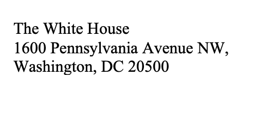

# Introduction to  HTML
## Markup  and  Programming Languages

We use languages to communicate with and give instructions to apps and computers.  Just like people, apps and computers understand speak different languages.

There are many different programming languages and each language communicates specific types of information.

Some languages are good at creating 3D Models, some are good at processing data, some languages are good at creating mobile apps, others are better at operating machines.

Multiple languages are needed  because we ask computers to perform so many different tasks.

**HTML** stands for **H**yper **T**ext **M**arkup **L**anguage

A **Markup** language controls appearance, structure, and formatting  of a text document.  This is different from a **Programming** Languages, which writes instructions for a computer to execute.



On the left in your file tree, notice the  ```index.html``` file.   Web Browsers can read and interpret HTML files.

HTML code is made of elements or tags that tell web browser where and how to display images, multimedia and text.

Notice the text in the html file:

```<h1>Hello World</h1>```

This is called an **element**. Click the green ```Run``` button. Notice how the text  will dispay on a web browser.

**HTML SYNTAX**



The Tags tell your web browser how to display the content. You must open and close most tags.

### Task 1

Type more elements underneath “Hello World” using the tags ```<h2>```, ```<h3>``` and ```<p>```.  It doesn’t matter what you write in between the tags.

Run the code.  How are the elements different?

---

# Common Elements

**Headings** are used to make headings and subheadings on a webpage.  Headings tags go from 1 through 6. 

## Task 2

Write elements for ```<h4>```,```<h5>``` and ```<h6>```.  The content between the tags is your choice. Run the code.

---

**Paragraphs** ```<p>``` are blocks of text.

**Button** ```<button>``` tags create clickable text (we will learn how to make buttons work later).

## Task 3

Write elements using the ```<p>``` and ```<button>``` tags. The content between the tags is your choice. Run the code.

---

# Nested Elements

An element can include multiple tags.

## Task 4

Write the following code on your html page;

```<p><i>Hello World</i></p>```

Run the code. The ```<i>``` (italic) tags are nested inside of the ```<p>``` tags.  The outermost tags always take priority.

---

In a nested element, the outermost tag is the **PARENT**.  The tag inside the parent is the **CHILD**.

## Task 5

Write “Hello World” in ```<p>``` paragraph tags and each of these nested tags:

```<strong>```, ```<b>```,```<i>```,```<u>```. Run the Code.

---

You can also add tags around a single word or phrase in a sentence to change the appearance.

## Task 6

Write HELLO  WORLD in ```<p>``` tags. Add either 
```<strong>```, ```<b>```,```<i>```,```<u>``` around the word WORLD only.  Run the code.

# Line Breaks

## Task 7

You can use a ```<br>``` tag to add a line break in the middle of a paragraph. You do not have to close a ```<br>``` tag. When ever you want to start a new line, add a ```<br>``` tag.

Copy and Paste the White House address below on to your HTML Page:

```<p>The White House 1600 Pennsylvania Avenue NW, Washington, DC 20500</p>```

Add line breaks to the paragraph to make it look like this:


---


There are many HTML tags. Once you have a grasp of HTML SYNTAX, you don’t have to memorize HTML tags.  Like most web developers, you can use web resources to look them up!


[Click Here for List of Common HTML Tags](https://www.semrush.com/blog/html-tags-list/)

# Lesson Activity

Copy and paste the code below to your HTML page. 

```<h1>Heading 1<h1>
 
<h2  Heading 2</h3>
    
<p Paragraph Tag

<h1 You can emphasize one <em>word</em in a sentence</h1>

<h2 <strong Words can be Bold!/strong></h2>

<p>You can create spaces between paragraphs with line breaks</p>

<br

<p>You just create a space with a line break!</span></p>

<h1>Which is better, ice cream or cake?<h6>

<h>Ice cream is obviously better than cake.h>

<p Ice cream is definitely better than cake! I think ice cream is better because: h>
```
You will notice there are a lot of errors.  A good percentage of a web developer’s time is spent fixing or “debugging” improperly written code.

Fix as many coding errors as you can find.